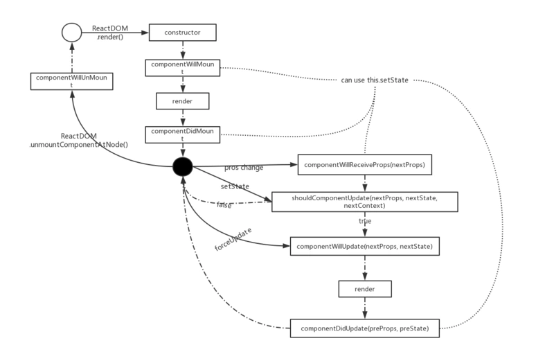
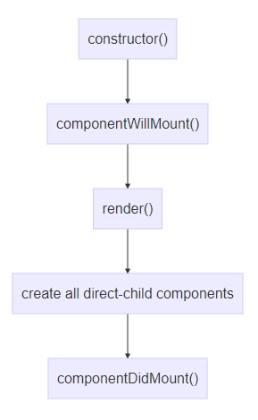
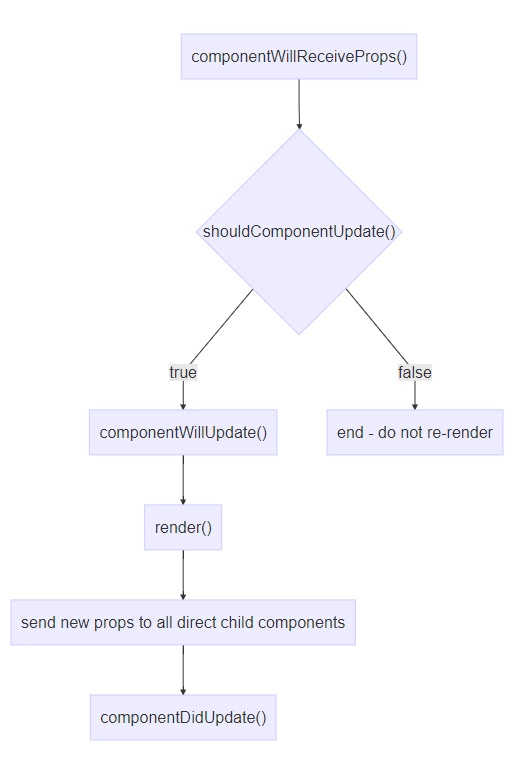
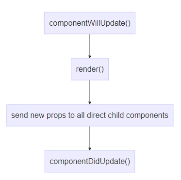
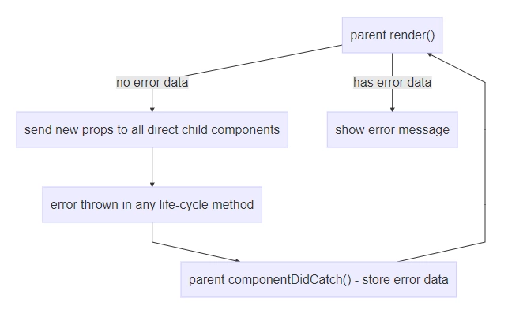

### react的生命周期理解

react提供了许多钩子函数给用户使用，我们可以在适当的时机调用这些钩子函数，以构建多样化的组件，这些钩子函数我们称之为react组件的生命周期函数



## 组件包含3个阶段
挂载，更新，卸载，react16还增加了错误处理compoenntDidCatch

## 挂载
组件被实例化并挂载在到dom树这一过程称为挂载



* constructor()
* componentWillMount()
* render()
* componentDidMount()

## 更新
当组件的属性、状态改变(通过setState触发)或者执行forceUpdate时会重新渲染



componentWillReceiveProps()
shouldComponentUpdate()
componentWillUpdate()
render()
componentDidUpdate()
当执行this.forceUpdate时，shouldComponentUpdate将不会被触发



卸载
当一个组件被移出Dom树时，组件就会被卸载

componentWillUnmount()

## Error Handling


componentDidCatch()
## constructor
当组件被实例化时，构造函数就被会最先执行。需要注意的是constructor的第一行必须是super(props)语句。


## 设置组件的初始状态
bind function
简单解释下bind function,当类的方法作为事件处理函数时，有可能会丢失this指向，有两种常见的解决方案：
```
// This binding is necessary to make `this` work in the callback
this.handleClick = this.handleClick.bind(this); // 上面提到的bind function
```
```
使用箭头函数声明处理函数，个人比较推荐这种方案，代码简洁干净
handleClick = () => {}
```

1. 不要向后台发送请求进而更新组件状态
2. 使用this.setState初始化

强行在constructor中调用this.setState会发出的警告，在constructor中调用this.setState是没有任何作用的


## componentWillMount
它也只会在挂载过程中被调用一次，它的作用和constructor没有太大差异。有很多人在componentWillMount中请求后台数据，认为这样可以更早的得到数据，componentWillMout是在render函数执行前执行的，虽然请求是在第一次render之前发送的，但是返回并不能保证在render之前完成。React中不推荐在componentWillMount中发送异步请求?。

还有一点需要了解： 在componentWillMount中执行this.setState是不会触发二次渲染的。仔细思考一下，componentWillMount好像没啥卵用了。正所谓存在即合理，在服务端渲染的场景中componentDidMount是不会被执行的，因此可以在componnetWillMount中发生AJAX请求。
Usage

1. 使用this.setState更新组件状态
2. 发送AJAX请求(服务端渲染场景中)

DON’T

1. 发送AJAX请求(浏览器渲染场景中)
## componentDidMount
此函数只会被调用一次既组件挂载完成时，在render函数调用之后。组件挂载完成表示它的子组件也全部被挂载完成。父组件render ->子组件render->子子组件render ... ...子子组件DidMount -> 子组件DidMount -> 父组件DidMount。React就是个递归的世界。componentDidMount函数中可以发生异步请求。

Usage

1. 发送AJAX请求
DON’T

1. this.setState更新状态，因为会触发二次渲染，不是必须，最好避免
## componentWillReceiveProps
当父组件re-render时该钩子函数就会执行，即使所传入的属性没有改变。这个钩子最大的用途：组件的部分状态是依赖于属性时做状态同步使用，在其中使用this.setState是不会触发额外的渲染的，this.setState的状态更新和props触发的render合并一次进行。要合理使用componentWillReceiveProps需记住做好条件判断：
```
componentWillReceiveProps(nextProps) {
  if(nextProps.myProp !== this.props.myProps) {
    // nextProps.myProp has a different value than our current prop
  }
}
```
请不要尝试在componentWillReceiveProps中发送异步请求(React Fiber后该钩子函数可能会被触发多次)?

Usage

1. 根据Props的更新同步组件状态
DON’T

1. 发生异步请求
## shouldComponentUpdate
shouldComponentUpdate主要是用来优化React应用性能的，水平没达到一定高度就不要去动它了。组件的状态或者属性改变时都会触发该函数，但只有在返回true时，组件才会被重新渲染。

Usage
1. 一般可以用来优化组件性能，通过nextProps和的this.props的shallow比较或者deep比较来决定是否返回true，不过这种比较也是消耗性能的，所以需要做个权衡。

## componentWillUpdate
当我们没有覆写componentShouldUpdate时，componentWillUpdate会在其之后立即执行。当shouldComponent被覆写过时，componentWillUpdate主要用来取代componentWillReceiveProps，用来同步Props至组件的部分状态。

Usage

1. 同步Props到组件状态
DON’T

1. 发生异步请求
## componentDidUpdate
它和componentDidMount的功能类似，componentDidMount发生于组件的首次render之后，而componentDidUpdate则是发生于组件状态及属性变化所导致的re-render之后。主要是用来请求后台数据。和componentWillReceiveProps类似，做相应处理时，需要做属性是否变更的判断，如下面代码所示。有趣的一点： componentWillReceiveProps接收的参数是nextProps, componentDidUpdate接收的是preProps。

componentDidUpdate(prevProps) {
  if(prevProps.myProps !== this.props.myProp) {
    // this.props.myProp has a different value
    // ...
  }
}
usage

1. 异步请求
DON’T

1. this.setState更新状态，会触发二次渲染，处理不当会导致死循环
## componentWillUnmount
当组件被卸载时被调用，在这里主要做一些清理操作，清理定时器、关闭socket、清除监听器等等

## omponentDidCatch
React的错误机制：子组件中产生的错误若并未被捕获或处理会抛给父组件，若上层也一直没有处理，错误将会被抛至最顶层导致浏览器白屏。
React16开始添加了一个新的特性错误处理。componentDidCatch十分特别，它只可以处理子组件中产生的、未处理的错误，能够捕获的错误类型有子组件render函数中产生的错误及生命周期函数中产生的非异步错误。用法：

//父组件或祖宗组件中实现
```
componentDidCatch(errorString, errorInfo) {
  this.setState({
    error: errorString
  });
  ErrorLoggingTool.log(errorInfo);
}
render() {
  if(this.state.error) return <ShowErrorMessage error={this.state.error} />
  return (
    // render normal component output
  );
}
```
